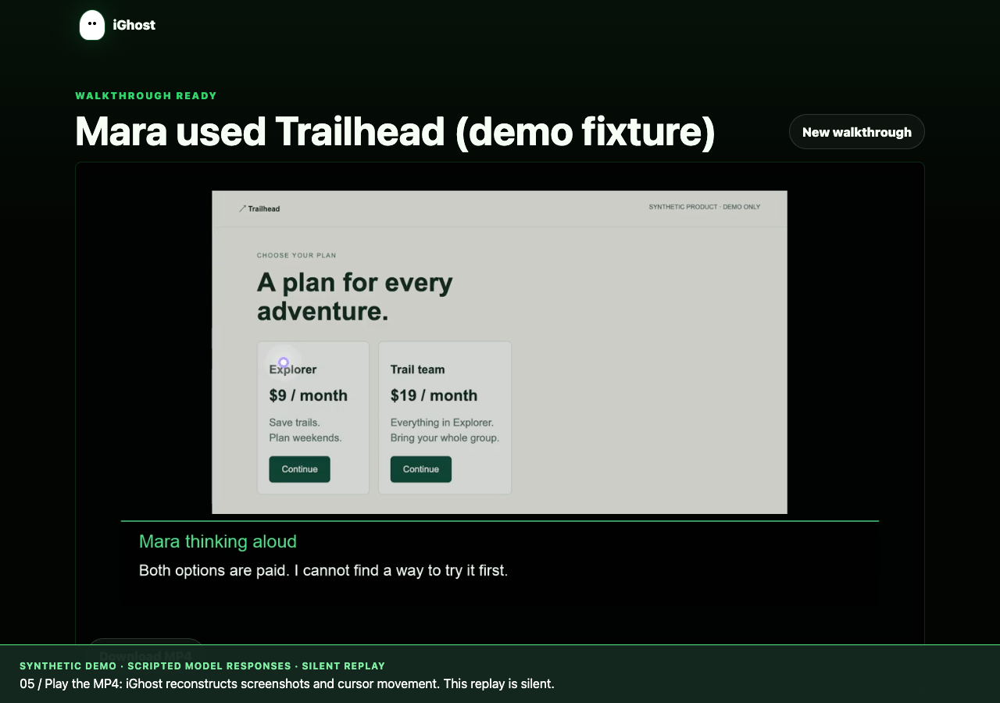

# iGhost

**Summon AI users before real users rage-quit.**

AI usability testing that records synthetic user sessions, narrates the failure points, and turns them into actionable product fixes.

[](https://github.com/Jo2234/iGhost/actions/workflows/ci.yml)

[](docs/demo/product-demo.mp4)

**[Watch the 76-second product demo](docs/demo/product-demo.mp4)** · [Watch the generated sample replay](docs/demo/sample-replay.mp4) · [Demo provenance and reproduction](docs/demo/README.md)

The demo is a continuous recording of the real interface with a clearly labeled local fixture and scripted model responses. It shows sign-in, task/persona selection, MP4 playback, actionable advice, and patch-prompt creation. The replay inside the app is assembled from screenshots and cursor animation. This sample is silent: narration synthesis, live OpenAI execution and GitHub delivery are not demonstrated.

iGhost is an AI usability lab for builders who need fast, visceral feedback on a website or product flow. Paste a URL, give the ghost a job, choose the kind of user you want to emulate, and watch a synthetic user try the product in a narrated walkthrough.

Instead of another generic UX report, iGhost produces a playable ghost session: what the user saw, where they hesitated, what confused them, and what to fix next.

## What It Does

- Drives a browser through the target website.
- Builds an MP4 replay from captured screenshots with a highlighted cursor.
- Generates a personality-matched OpenAI voiceover.
- Turns the walkthrough into actionable product advice.
- Creates a Codex-ready patch prompt from the findings.

See [architecture and remaining roadmap](iGhost_product_engineering_spec.md) for the implemented browser/media flow, evidence boundaries and limitations.

## Product Loop

1. Add a website URL.
2. Describe what the ghost should try to do.
3. Choose or create a ghost persona.
4. Watch the ghost use the product.
5. Review concrete fixes.
6. Send the fix request to Codex for a branch/PR workflow.

## Quick Start

Requirements:

- Node.js 24 or newer
- Chrome, Chromium, Brave, or Edge for browser capture
- ffmpeg for MP4 generation
- An OpenAI API key

Create a `.env` file:

```bash
OPENAI_API_KEY="<your-openai-api-key>"
IGHOST_ACCESS_TOKEN="<a-random-owner-token-at-least-24-characters>"
OPENAI_ANALYSIS_MODEL="<your-preferred-openai-model>"
OPENAI_TTS_MODEL="gpt-4o-mini-tts"
PORT=4173
```

Generate the owner token with `openssl rand -hex 32`, save it in `.env`, then enter it on the sign-in screen. Startup refuses a missing or short token. This is a **single-owner lab**: private APIs and generated media require an owner session (HttpOnly, SameSite=Strict, eight hours) or `Authorization: Bearer <owner-token>` for scripts. Browser mutations also require a matching Origin. Restarting expires browser sessions.

Local runs bind to `127.0.0.1` by default. Set `IGHOST_BIND_HOST=0.0.0.0` only when intentionally serving other machines; Docker sets this for Render. Production uses Secure cookies and must sit behind HTTPS.

Run the app:

```bash
npm start
```

Then open:

```txt
http://localhost:4173
```

## Voice

iGhost uses OpenAI speech generation for the final MP4 voiceover. The default TTS model is `gpt-4o-mini-tts`, with expressive stage directions passed through the `instructions` field so each ghost sounds like a real person thinking out loud instead of a narrator reading captions.

The reasoning and voiceover script layer uses `OPENAI_ANALYSIS_MODEL`. That model shapes what the ghost notices, how they interpret the screen, and the personality-specific script that is then performed by the TTS model.

## Routes

- `/` - landing page and ghost test form
- `/test/:testId` - generated walkthrough and advice
- `/api/tests/:testId/codex-patch` - create a Codex-ready patch request
- `/api/tests/:testId/codex-patch/send` - create a GitHub issue that tags `@codex` with the patch request

GitHub delivery is disabled until `IGHOST_REPO_URL` names the one authorized repository and `IGHOST_GITHUB_TOKEN` (or `GITHUB_TOKEN`) provides a repository-scoped token with issue-write permission. The app does not read your local `gh` login. The send button reports success only after GitHub confirms an issue; issue creation does not guarantee Codex implementation. Repeated sends reuse an existing issue, including after regenerating its prompt.

Reports are private by default. The owner can `POST /api/tests/:testId/report` with `{"isPublic":true}` to share its redacted JSON view, or `false` to revoke it. Shared reports expose only display fields, advice, ghost names and a report-scoped video link. They omit code context, uploaded screenshots, private persona details, follow-ups and patch prompts. Existing public reports remain public during migration and can be revoked with the same endpoint.

## Website Capture

When a user enters a website URL, iGhost launches a local browser, captures screenshots while the ghost navigates, and sends those screenshots to OpenAI vision along with the user's task prompt.

Set `CHROME_PATH` if your browser is not in a standard location.

Screenshots and walkthroughs use one isolated browser setup. Every session has a loopback egress proxy that validates all DNS answers and connects to the chosen public IP without resolving the hostname again. HTTP, HTTPS CONNECT and WebSocket upgrades use this boundary, including redirects and subresources. Chromium's implicit loopback bypass, QUIC and non-proxied WebRTC UDP are disabled. Private, link-local, mapped-private and special-use addresses fail closed.

This is browser network policy, not an operating-system sandbox against a compromised browser. Keep Chromium updated and isolate the deployment from sensitive workloads.

## Saved Data

Legacy `data/db.json` migrates automatically to individual `tests/*.json` and `reports/*.json` records. The original file is kept unchanged as a backup. Updates use a short write queue and atomic replacement; malformed JSON fails loudly. Generation saves completed stages, joins duplicate in-flight runs and reuses successful assets on retry. Use **one server process per data directory**; multiple replicas sharing this JSON store require a transactional database first. Back up the whole data directory and generated media together.

## Render Deployment

The repo includes a Dockerfile and `render.yaml` Blueprint for Render. The container installs Chromium and ffmpeg, stores local data under the attached `/data` disk, and exposes `/health` for Render health checks.

Create a Blueprint from this GitHub repo in Render and provide `OPENAI_API_KEY` when prompted. Render generates `IGHOST_ACCESS_TOKEN`; retrieve it from the service environment settings for sign-in. Configure repository/token variables separately for GitHub delivery. The Blueprint uses the `starter` plan because browser capture and MP4 rendering need more headroom than a static/free deployment.

The image includes all `lib/` modules. `IGHOST_GENERATED_DIR` controls both where assets are written and where the encoder reads narration; public `/generated/...` URLs are independent of internal paths.

## Checks

[CI](.github/workflows/ci.yml) runs `npm run check` and `npm test` on Node.js 24 in Debian, with Chromium and ffmpeg installed and explicitly required. It exercises the real browser egress boundary and narrated MP4 encoder on every push and pull request.

Locally, run `npm run check` and `npm test`. Tests use synthetic data and mocked service boundaries; no real issue is sent. The MP4 smoke test runs when a local ffmpeg executable is available. To exercise Chromium against synthetic sites too:

```bash
IGHOST_TEST_BROWSER="/path/to/chromium" npm test
```

The browser test uses a fresh temporary profile, denies all destinations except its local fixture through the test proxy, verifies loopback redirects/subresources stay blocked, then stops its process group.

## Safety Notes

- Keep `.env` out of Git.
- Review Codex-generated changes before merging.
- Do not include private screenshots, API keys, or local data in public reports or GitHub issues.
- Website network access is enforced by the browser egress proxy as well as URL validation; initial URL validation alone is not the boundary.
- JSON API bodies are capped at 1 MB by default and API calls have a basic per-client rate limit. Tune with `IGHOST_RATE_LIMIT_MAX` and `IGHOST_RATE_LIMIT_WINDOW_MS`.

Rate limits use the direct peer IP instead of caller-controlled forwarding headers. Behind a reverse proxy, clients share that peer limit; owner authentication remains the access boundary.

See `SECURITY_HARDENING_DEMO.md` for demo-ready validation examples and test coverage notes.

## License

[MIT](LICENSE), copyright Johan Vaz. Chromium, ffmpeg and development tools retain their own licenses; they are not bundled with this source repository.
